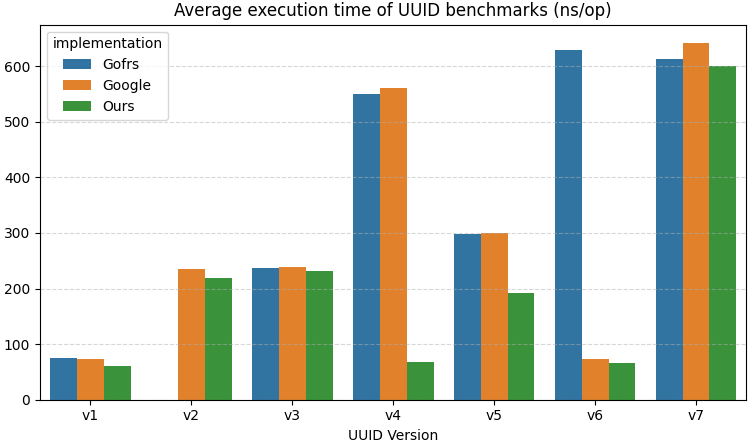

# uuid

Fast UUID generator.

## Supported versions

- [x] Version 1
- [x] Version 2
- [x] Version 3
- [x] Version 4
- [x] Version 5
- [x] Version 6
- [x] Version 7

## Benchmark test

```
goos: linux
goarch: amd64
pkg: github.com/0x0FACED/uuid
cpu: AMD Ryzen 5 5500U with Radeon Graphics         
BenchmarkUUIDv1_Ours-12         20999936                57.47 ns/op            0 B/op          0 allocs/op
BenchmarkUUIDv1_Ours-12         20186533                58.25 ns/op            0 B/op          0 allocs/op
BenchmarkUUIDv1_Ours-12         20329052                59.64 ns/op            0 B/op          0 allocs/op
BenchmarkUUIDv1_Ours-12         18925119                60.37 ns/op            0 B/op          0 allocs/op
BenchmarkUUIDv1_Ours-12         20881476                57.39 ns/op            0 B/op          0 allocs/op
BenchmarkUUIDv1_Google-12       16602871                71.76 ns/op            0 B/op          0 allocs/op
BenchmarkUUIDv1_Google-12       16690766                72.87 ns/op            0 B/op          0 allocs/op
BenchmarkUUIDv1_Google-12       15567649                75.49 ns/op            0 B/op          0 allocs/op
BenchmarkUUIDv1_Google-12       15815245                71.14 ns/op            0 B/op          0 allocs/op
BenchmarkUUIDv1_Google-12       16728276                70.73 ns/op            0 B/op          0 allocs/op
BenchmarkUUIDv1_Gorfs-12        17033306                69.00 ns/op            0 B/op          0 allocs/op
BenchmarkUUIDv1_Gorfs-12        17425020                71.96 ns/op            0 B/op          0 allocs/op
BenchmarkUUIDv1_Gorfs-12        14771188                69.01 ns/op            0 B/op          0 allocs/op
BenchmarkUUIDv1_Gorfs-12        16247008                70.54 ns/op            0 B/op          0 allocs/op
BenchmarkUUIDv1_Gorfs-12        15859628                69.46 ns/op            0 B/op          0 allocs/op
BenchmarkUUIDv2_Ours-12          5414661               220.8 ns/op             0 B/op          0 allocs/op
BenchmarkUUIDv2_Ours-12          5409886               219.9 ns/op             0 B/op          0 allocs/op
BenchmarkUUIDv2_Ours-12          5452830               219.9 ns/op             0 B/op          0 allocs/op
BenchmarkUUIDv2_Ours-12          5375066               220.3 ns/op             0 B/op          0 allocs/op
BenchmarkUUIDv2_Ours-12          5435112               219.8 ns/op             0 B/op          0 allocs/op
BenchmarkUUIDv2_Google-12        5063090               236.2 ns/op             0 B/op          0 allocs/op
BenchmarkUUIDv2_Google-12        5074537               235.3 ns/op             0 B/op          0 allocs/op
BenchmarkUUIDv2_Google-12        5045595               236.3 ns/op             0 B/op          0 allocs/op
BenchmarkUUIDv2_Google-12        5100937               242.2 ns/op             0 B/op          0 allocs/op
BenchmarkUUIDv2_Google-12        4994786               235.9 ns/op             0 B/op          0 allocs/op
BenchmarkUUIDv3_Ours-12          5083372               241.6 ns/op           144 B/op          4 allocs/op
BenchmarkUUIDv3_Ours-12          5016966               241.4 ns/op           144 B/op          4 allocs/op
BenchmarkUUIDv3_Ours-12          4949304               240.0 ns/op           144 B/op          4 allocs/op
BenchmarkUUIDv3_Ours-12          4974438               243.0 ns/op           144 B/op          4 allocs/op
BenchmarkUUIDv3_Ours-12          4926619               242.1 ns/op           144 B/op          4 allocs/op
BenchmarkUUIDv3_Google-12        4796034               247.7 ns/op           144 B/op          4 allocs/op
BenchmarkUUIDv3_Google-12        4848568               246.8 ns/op           144 B/op          4 allocs/op
BenchmarkUUIDv3_Google-12        4872985               247.6 ns/op           144 B/op          4 allocs/op
BenchmarkUUIDv3_Google-12        4764200               246.0 ns/op           144 B/op          4 allocs/op
BenchmarkUUIDv3_Google-12        4924530               247.9 ns/op           144 B/op          4 allocs/op
BenchmarkUUIDv3_Gofrs-12         4797765               252.9 ns/op           144 B/op          4 allocs/op
BenchmarkUUIDv3_Gofrs-12         4862901               253.8 ns/op           144 B/op          4 allocs/op
BenchmarkUUIDv3_Gofrs-12         4775005               249.9 ns/op           144 B/op          4 allocs/op
BenchmarkUUIDv3_Gofrs-12         4831238               251.7 ns/op           144 B/op          4 allocs/op
BenchmarkUUIDv3_Gofrs-12         4641108               255.2 ns/op           144 B/op          4 allocs/op
BenchmarkUUIDv4_Our-12          17117461                68.47 ns/op            0 B/op          0 allocs/op
BenchmarkUUIDv4_Our-12          17042155                67.53 ns/op            0 B/op          0 allocs/op
BenchmarkUUIDv4_Our-12          17164072                67.30 ns/op            0 B/op          0 allocs/op
BenchmarkUUIDv4_Our-12          15614954                68.87 ns/op            0 B/op          0 allocs/op
BenchmarkUUIDv4_Our-12          16214990                69.33 ns/op            0 B/op          0 allocs/op
BenchmarkUUIDv4_Google-12        2033109               568.9 ns/op            16 B/op          1 allocs/op
BenchmarkUUIDv4_Google-12        2002951               576.4 ns/op            16 B/op          1 allocs/op
BenchmarkUUIDv4_Google-12        2121259               569.8 ns/op            16 B/op          1 allocs/op
BenchmarkUUIDv4_Google-12        1927722               574.2 ns/op            16 B/op          1 allocs/op
BenchmarkUUIDv4_Google-12        2115675               590.6 ns/op            16 B/op          1 allocs/op
BenchmarkUUIDv4_Gofrs-12         2057848               567.9 ns/op            16 B/op          1 allocs/op
BenchmarkUUIDv4_Gofrs-12         2153323               550.1 ns/op            16 B/op          1 allocs/op
BenchmarkUUIDv4_Gofrs-12         2155024               554.5 ns/op            16 B/op          1 allocs/op
BenchmarkUUIDv4_Gofrs-12         2083617               556.6 ns/op            16 B/op          1 allocs/op
BenchmarkUUIDv4_Gofrs-12         2158005               556.3 ns/op            16 B/op          1 allocs/op
BenchmarkUUIDv5_Our-12           6537709               198.8 ns/op            24 B/op          1 allocs/op
BenchmarkUUIDv5_Our-12           5718648               202.0 ns/op            24 B/op          1 allocs/op
BenchmarkUUIDv5_Our-12           6098152               210.1 ns/op            24 B/op          1 allocs/op
BenchmarkUUIDv5_Our-12           5899185               187.4 ns/op            24 B/op          1 allocs/op
BenchmarkUUIDv5_Our-12           6390178               185.1 ns/op            24 B/op          1 allocs/op
BenchmarkUUIDv5_Google-12        4106773               286.9 ns/op           168 B/op          4 allocs/op
BenchmarkUUIDv5_Google-12        4145841               301.0 ns/op           168 B/op          4 allocs/op
BenchmarkUUIDv5_Google-12        4000243               308.1 ns/op           168 B/op          4 allocs/op
BenchmarkUUIDv5_Google-12        3955555               303.6 ns/op           168 B/op          4 allocs/op
BenchmarkUUIDv5_Google-12        4170256               302.7 ns/op           168 B/op          4 allocs/op
BenchmarkUUIDv5_Gofrs-12         3207034               314.6 ns/op           168 B/op          4 allocs/op
BenchmarkUUIDv5_Gofrs-12         4221594               294.8 ns/op           168 B/op          4 allocs/op
BenchmarkUUIDv5_Gofrs-12         4083728               344.1 ns/op           168 B/op          4 allocs/op
BenchmarkUUIDv5_Gofrs-12         4025864               302.1 ns/op           168 B/op          4 allocs/op
BenchmarkUUIDv5_Gofrs-12         3941733               306.5 ns/op           168 B/op          4 allocs/op
BenchmarkUUIDv6_Our-12          18396920                65.57 ns/op            0 B/op          0 allocs/op
BenchmarkUUIDv6_Our-12          16661672                65.10 ns/op            0 B/op          0 allocs/op
BenchmarkUUIDv6_Our-12          17435295                66.88 ns/op            0 B/op          0 allocs/op
BenchmarkUUIDv6_Our-12          17882170                67.64 ns/op            0 B/op          0 allocs/op
BenchmarkUUIDv6_Our-12          18065449                65.62 ns/op            0 B/op          0 allocs/op
BenchmarkUUIDv6_Google-12       14264035                78.86 ns/op            0 B/op          0 allocs/op
BenchmarkUUIDv6_Google-12       14951728                79.05 ns/op            0 B/op          0 allocs/op
BenchmarkUUIDv6_Google-12       16337718                74.97 ns/op            0 B/op          0 allocs/op
BenchmarkUUIDv6_Google-12       16451085                81.19 ns/op            0 B/op          0 allocs/op
BenchmarkUUIDv6_Google-12       16443512                74.27 ns/op            0 B/op          0 allocs/op
BenchmarkUUIDv6_Gofrs-12         1835128               648.1 ns/op            16 B/op          1 allocs/op
BenchmarkUUIDv6_Gofrs-12         1824901               702.4 ns/op            16 B/op          1 allocs/op
BenchmarkUUIDv6_Gofrs-12         1831963               621.0 ns/op            16 B/op          1 allocs/op
BenchmarkUUIDv6_Gofrs-12         1927111               662.9 ns/op            16 B/op          1 allocs/op
BenchmarkUUIDv6_Gofrs-12         1782142               649.6 ns/op            16 B/op          1 allocs/op
BenchmarkUUIDv7_Our-12           1990425               600.2 ns/op             0 B/op          0 allocs/op
BenchmarkUUIDv7_Our-12           2103853               573.6 ns/op             0 B/op          0 allocs/op
BenchmarkUUIDv7_Our-12           2100456               571.8 ns/op             0 B/op          0 allocs/op
BenchmarkUUIDv7_Our-12           2045240               604.6 ns/op             0 B/op          0 allocs/op
BenchmarkUUIDv7_Our-12           1948148               605.3 ns/op             0 B/op          0 allocs/op
BenchmarkUUIDv7_Google-12        1775641               667.8 ns/op            16 B/op          1 allocs/op
BenchmarkUUIDv7_Google-12        1708155               679.4 ns/op            16 B/op          1 allocs/op
BenchmarkUUIDv7_Google-12        1850067               697.7 ns/op            16 B/op          1 allocs/op
BenchmarkUUIDv7_Google-12        1640768               725.1 ns/op            16 B/op          1 allocs/op
BenchmarkUUIDv7_Google-12        1664174               669.9 ns/op            16 B/op          1 allocs/op
BenchmarkUUIDv7_Gofrs-12         1876887               652.9 ns/op            16 B/op          1 allocs/op
BenchmarkUUIDv7_Gofrs-12         1789802               647.9 ns/op            16 B/op          1 allocs/op
BenchmarkUUIDv7_Gofrs-12         1890902               645.9 ns/op            16 B/op          1 allocs/op
BenchmarkUUIDv7_Gofrs-12         1785714               622.2 ns/op            16 B/op          1 allocs/op
BenchmarkUUIDv7_Gofrs-12         1872841               671.2 ns/op            16 B/op          1 allocs/op
```

## Benchmark diagram

